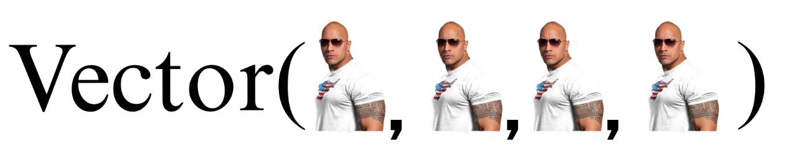

# **Scala-Vector**



## Введение
Scala — мультипарадигмальный язык программирования, спроектированный кратким и типобезопасным для простого и быстрого создания компонентного программного обеспечения, сочетающий возможности функционального и объектно-ориентированного программирования. Векторы обеспечивают баланс между быстрым случайным доступом и эффективными функциональными операциями, что делает их универсальным выбором для многих задач программирования.

## Что такое Scala-vector?
Векторы в scala - это неизменяемые структуры данных, обеспечивающие произвольный доступ к элементам, и аналогичные списку.

## Векторная реализация в Scala
В Scala создание и использование вектора очень просто. Вот базовый синтаксис для реализации и создания вектора в scala:

1. Импорт класса Vector: 
```scala
import scala.collection.immutable.Vector
```
2. Создание вектора:
```scala
val vector1: Vector[Int] = Vector(1, 2, 3, 4, 5)
val vector2: Vector[String] = Vector("apple", "banana", "orange")
```
Использование:
1. Использование оператора +:

Оператор +: - это символьный метод, который позволяет добавлять элемент перед вектором. Синтаксис использования этого оператора следующий:
```scala
val originalVector = Vector(1, 2, 3)
val prependedVector = 0 +: originalVector
```
В этом примере 0 +: originalVector создает новый вектор с элементом 0, добавленным в начале, в результате чего получается Vector(0, 1, 2, 3).

2. Использование оператора :+

Оператор :+ позволяет добавить элемент к вектору. Синтаксис использования этого оператора следующий:
```scala
val originalVector = Vector(1, 2, 3)
val appendedVector = originalVector :+ 4
```
В этом примере originalVector :+ 4 создает новый вектор с элементом 4, добавленным в конце, в результате чего получается Vector(1, 2, 3, 4).

## Произвольный доступ и случайные обновления
В Scala коллекция Vector обеспечивает эффективный произвольный доступ и случайные обновления, что делает ее отличным выбором для сценариев, требующих частого извлечения и модификации элементов.

1. Произвольный доступ:

Произвольный доступ означает возможность доступа к элементам, расположенным в произвольных позициях внутри вектора. Vector обеспечивает эффективный произвольный доступ благодаря своей внутренней структуре данных, известной как "Relaxed Radix Balanced Trees" (Деревья со сбалансированным основанием). Древовидная организация гарантирует, что доступ к элементу с заданным индексом занимает O(log32(n)) времени, где "n" - количество элементов в векторе. Такая логарифмическая временная сложность гарантирует, что доступ к элементам остается быстрым даже для больших коллекций.
```scala
val vector = Vector(10, 20, 30, 40, 50)
val elementAtIndex2 = vector(2) // Returns 30
```

2. Случайные обновления:

Случайные обновления относятся к изменению элементов в произвольных позициях внутри вектора. Поскольку вектор неизменяем, он не допускает прямого изменения его элементов. Вместо этого, когда вы обновляете элемент с определенным индексом, создается новый экземпляр Vector с обновленным элементом, оставляя исходный Vector неизменным. Эта неизменяемость обеспечивает потокобезопасность и делает Vector подходящим для парадигм функционального программирования.
```scala
val originalVector = Vector(10, 20, 30, 40, 50)
val updatedVector = originalVector.updated(3, 99)
```
В приведенном выше примере updatedVector будет новым вектором с элементом с индексом 3, измененным на 99. Исходный вектор originalVector остается неизменным.

Как произвольный доступ, так и случайные обновления в Vector имеют эффективную временную сложность O(log32(n)), что позволяет им работать хорошо даже для больших коллекций. Кроме того, поскольку Vector является неизменяемой структурой данных, эти операции потокобезопасны и подходят для функционального программирования, обеспечивая предсказуемое и надежное поведение в параллельных средах.

## Реализация
Scala-vector реализуется с помощью Relaxed Radix Balanced Trees.

Давайте посмотрим, как выполняется доступ к элементу дерева. Предположим, необходимо обратиться к элементу 17. Мы берём бинарное представление индекса и разбиваем его на группы размером с фактор ветвления.

В каждой группе мы используем соответствующее бинарное значение и таким образом спускаемся вниз по дереву.

Далее, предположим, нам необходимо сделать изменение в этой структуре данных

Для этого вначале необходимо скопировать блок, в котором находится элемент, а затем скопировать каждый внутренний узел на пути к элементу.

## Асимптотика

RRB-дерево — 32-арное дерево.\
n — количество элементов.\
b = 32 — фактор ветвления.\
h = O(log₃₂ n)\
Узел содержит ≤ b дочерних узлов или элементов.

Обновление элемента: O(h)=O(log n) (копирование пути от корня к листу (копирование узла O(b) = O(1)))

Взятие среза: O(log n) (найти начальный и конечный узлы O(2 log n) = O(log n) и копирование необходимых поддеревьев O(log n) => итоговая асимптотика O(3 log n) = O(log n))

Доступ по индексу: O(log n) (чтобы опуститься в глубь на h)

Добавление элемента ~ O(1)
амортизированно банковским методом.\
Будем при добавлении элемента брать с ним 3 монетки:
- одну тратим на добавление элемента.
- две тратим на перекопирование элементов, создание нового узла и обновление структуры (при переполнении узла).

## Когда использовать

- Неизменяемая последовательность с быстрым произвольным доступом.
- Эффективные функциональные операции со средними и большими коллекциями.
- Баланс между производительностью и функциональным стилем программирования.

## Итог
- Scala-vector обеспечивает эффективный произвольный доступ и обновления, что делает его подходящим для сценариев, требующих частого поиска и модификации элементов.
- Scala Vector реализован с использованием "Расслабленных деревьев, сбалансированных по основанию" (RRB-Trees), древовидной структуры данных, которая обеспечивает сбалансированную производительность для больших коллекций.
- Временная сложность для таких распространенных операций, как произвольный доступ и обновления, равна O(log32(n)), где "n" - количество элементов в векторе, что обеспечивает хорошую производительность даже для больших коллекций.
- Будучи неизменяемым, Scala Vector гарантирует потокобезопасность и подходит для парадигм функционального программирования, где неизменяемость необходима для предсказуемого поведения.
- Он поддерживает различные методы итерации, преобразования и фильтрации элементов, что позволяет удобно манипулировать данными.
- Предварение и добавление элементов к Scala Vector также являются эффективными операциями с постоянной временной сложностью, равной O(1).

## Используемые источники
* https://ru.ruwiki.ru/wiki/Scala_%28%D1%8F%D0%B7%D1%8B%D0%BA_%D0%BF%D1%80%D0%BE%D0%B3%D1%80%D0%B0%D0%BC%D0%BC%D0%B8%D1%80%D0%BE%D0%B2%D0%B0%D0%BD%D0%B8%D1%8F%29
* https://ref.coddy.tech/scala/scala-vectors
* https://www.geeksforgeeks.org/scala/scala-vector/?ysclid=mjlwihckh4170487459
* https://www.scaler.com/topics/scala/scalavector/
* https://habr.com/ru/companies/jugru/articles/487100/?ysclid=mjm354j198451574981