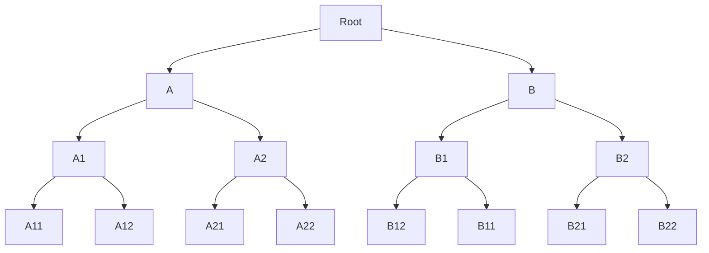

# Hash Tree (Merkle Tree)
### Сделано Гриценко Г.М. 2025

---
## Введение

  
Hash Tree (Merkle Tree) — это структура данных, предназначенная для эффективной проверки целостности и подлинности данных. Она широко используется в распределённых файловых системах, криптографии и сетевых протоколах, где критична целостность и статус изменения данных.


## Минутка Истории

Дерево Меркла было предложено Ральфом Мерклом в 1979 году

Изначально структура разрабатывалась для криптографических протоколов, но со временем стала основой для множества практических систем:

- блокчейны, например для биткойна
- VCS Git
- распределённые файловые системы
- P2P-сети и базы данных.

Основная идея — представить большой набор данных в виде одного компактного хэша, который однозначно характеризует всё содержимое. Более того, этот хэш будет отражать были ли изменены данные до их получения.

---
## Что такое Hash Tree

**Hash Tree** — это обычно бинарное дерево, в котором:

- листья содержат хэши исходных данных,
- каждый внутренний узел содержит хэш от конкатенации хэшей его детей,
- корень дерева является хэшем всего набора данных.

Формально, для любого внутреннего узла:

```

H = hash(H_left || H_right)

```

где `H_left` и `H_right` — хэши левого и правого поддерева.

---

## Пример структуры



- `A11, A12, B11, B12, A21, A22, B21, B22` — хэши исходных данных
- `A1 = hash(A11 || A12)`
- `B1 = hash(B11 || B12)`
- `Root = hash(A || B)`
---

## Основные свойства

### Проверка целостности

Если изменить хотя бы один элемент данных, изменится его хэш, затем хэш родительского узла и так далее вплоть до корня. Это позволяет быстро определить факт изменения данных.

### Доказательство включения

Чтобы доказать, что элемент содержится в дереве, достаточно передать:
- сам элемент,
- хэши соседних узлов на пути от листа к корню.

Количество таких хэшей логарифмически зависит от размера дерева.

---


## Ассимптотики

| Операция                    | Сложность |
|-----------------------------|-----------|
| Построение дерева           | O(n)      |
| Хранение                    | O(n)      |
| Получение корня             | O(n)      |
| Доказательство включения    | O(log n)  |
| Проверка доказательства     | O(log n)  |

где `n` — количество элементов (листьев дерева).

---

## Доказательства ассимптотик

### Построение дерева

Построение хэш дерева из `n` элементов занимает `O(n)` времени.

**Доказательство:**  
Рассмотрим бинарное дерево, построенное над `n` листьями.

- На уровне 0 (листья) вычисляется `n` хэшей.
- На уровне 1 — `n/2` хэшей.
- На уровне 2 — `n/4` хэшей.
- $\dots$
- На последнем уровне — `1` хэш (корень).

Общее число вычислений хэшей:
```
n + n/2 + n/4 + ... + 1
```
Это убывающая геометрическая прогрессия с первым членом `n` и знаменателем `1/2`.
Сумма такой прогрессии:
```
S = n * (1 / (1 - 1/2)) = 2n
```

Следовательно, суммарное количество операций ограничено сверху величиной `2n`, то есть линейно зависит от `n`.

$\Rightarrow$ время построения дерева — `O(n)`.

---

### Хранение дерева

Дерево занимает `O(n)` памяти.  
**Доказательство:**
В дереве:
- `n` листьев,
- `n - 1` внутренних узлов (свойство полного бинарного дерева).
Общее число узлов:
```
n + (n - 1) = 2n - 1
```
Каждый узел хранит один хэш фиксированного размера, значит память пропорциональна числу узлов.

$\Rightarrow$ асимптотическая сложность по памяти — `O(n)`.

---
### Получение корня
Получение корня требует `O(n)` времени.  
**Доказательство:**  
Корень дерева вычисляется только после вычисления всех внутренних узлов и листьев. Это означает, что алгоритм обязан обработать каждый элемент хотя бы один раз.

Поскольку построение дерева уже доказано как `O(n)`, получение корня (как его финальный результат) не может быть быстрее и не требует дополнительных асимптотических затрат.

$\Rightarrow$ получение корня имеет сложность `O(n)`.

---

### Доказательство включения
Размер включения и время его построения равны `O(log n)`.

**Доказательство:**  
Дерево хэшей является бинарным деревом с `n` листьями. Его высота:
```
h = log₂n
```
Чтобы доказать включение одного листа, необходимо:
- на каждом уровне дерева передать один соседний хэш,
- количество уровней равно высоте дерева.

Следовательно, число передаваемых хэшей равно `log₂ n`.

$\Rightarrow$ доказательство включения строится за `O(log n)`.

---

### Доказательство включения - сложность

Проверка доказательства включения занимает `O(log n)` времени.

**Доказательство:**

Проверка состоит из последовательных шагов:

1. Берётся хэш проверяемого элемента.
2. Он поочерёдно комбинируется с хэшами из доказательства.
3. На каждом шаге вычисляется один хэш.
4. Всего шагов столько же, сколько уровней дерева — `log₂ n`.
Каждый шаг выполняется за константное время.

$\Rightarrow$ проверка доказательства выполняется за `O(log n)`.

---

## Вывод

Все основные операции дерева хэшей обладают оптимальными асимптотиками:
- линейное время и память для построения
- логарифмическое время для доказательства и проверки включения.

Это делает дерево хэшей эффективной и масштабируемой структурой данных для работы с большими объёмами информации.

## Реализация на Python

```python
import hashlib

def hash_data(data: bytes) -> bytes:
    return hashlib.sha256(data).digest()

class MerkleTree:
    def __init__(self, data_blocks):
        self.leaves = [hash_data(d) for d in data_blocks]
        self.root = self.build_tree(self.leaves)

    def build_tree(self, nodes):
        if len(nodes) == 1:
            return nodes[0]

        next_level = []
        for i in range(0, len(nodes), 2):
            left = nodes[i]
            right = nodes[i] if i + 1 == len(nodes) else nodes[i + 1]
            next_level.append(hash_data(left + right))

        return self.build_tree(next_level)
```