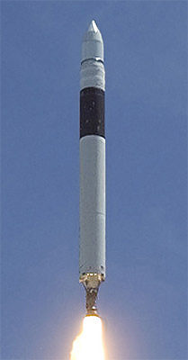
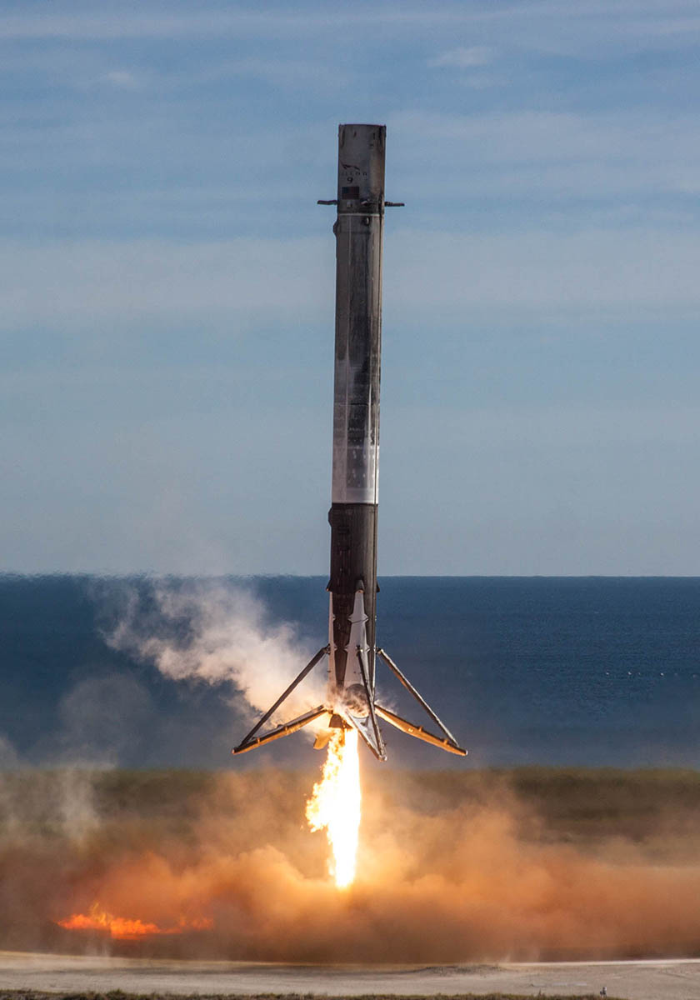
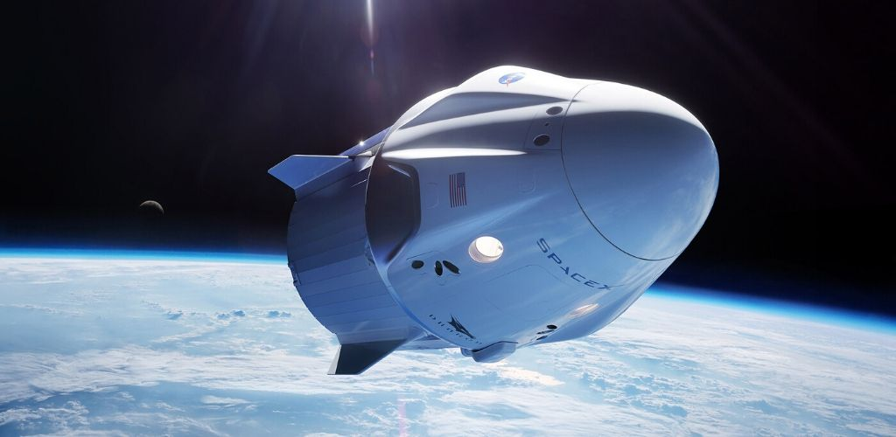
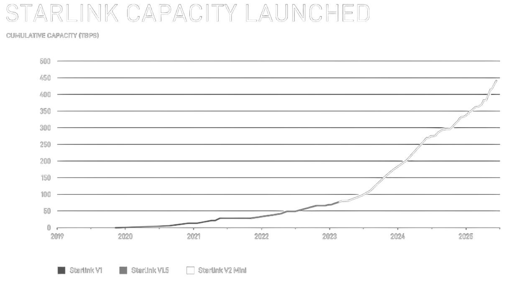
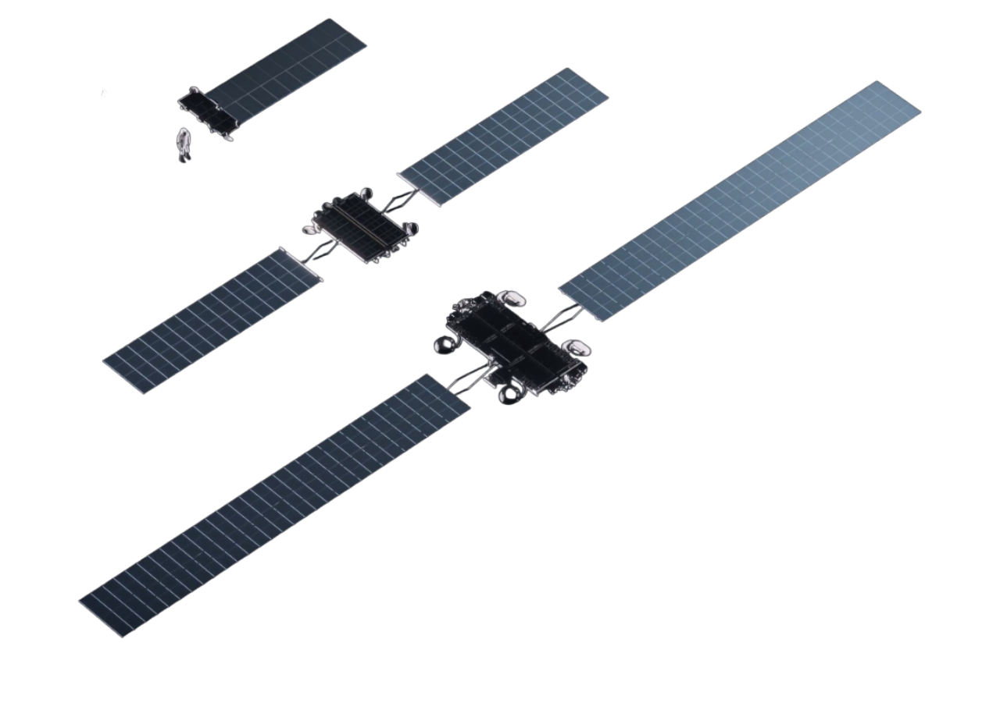
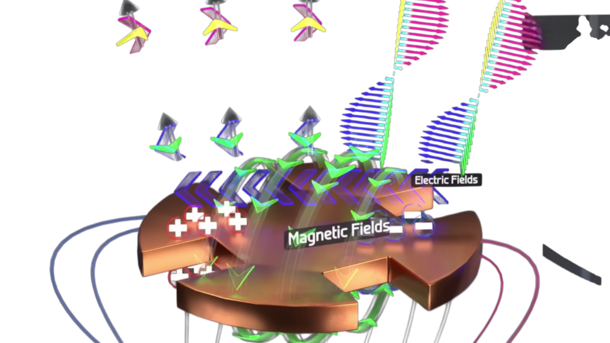

#  Архитектура спутниковой сети Starlink

**Автор:** Новиков А.

# Введение

В данной работе рассматривается спутниковая система Starlink, являющаяся самой масштабной LEO$^{1}$-сетью в мире, целью которой является предоставление широкополосного доступа в интернет массовым пользователям. Также одной из альтернативных задач является обеспечение связи в удалённых и труднодоступных регионах Земли, где традиционные способы подключения либо невозможны, либо экономически нецелесообразны$^{2}$.

---

$^{1}$ Low Earth Orbit - низкая околоземная орбита

# Историческая часть

  

## SpaceX: появление компании

Компания Space Exploration Technologies Corporation, известная как SpaceX, была основана миллиардером и предпринимателем Илоном Маском 14 марта 2002 года. Он не был первым, начало 2000-х годов считается периодом активного роста частного сектора аэрокосмической отрасли$^{1}$. До этого периода отрасль практически полностью принадлежала государству и напрямую от него зависела, однако, с появлением частных коммерческих компаний ситуация начала постепенно меняться. Но несмотря на это, государственная поддержка оставалась и продолжает сейчас оставаться одним из ключевых факторов развития данной области.

К идее создания такой компании профессиональное сообщество отнеслось крайне скептически, и на это было несколько причин. Во-первых, Илон Маск не имел профильного инженерного образования и пошёл в отрасль без фундаментальной технической базы. Сам он позже говорил: "Я просто купил книги и пошёл читать, много читать$^{2}$". Во-вторых, целью компании было "радикальное снижение стоимости вывода полезной нагрузки на орбиту за счёт разработки многоразовых ракет-носителей". Идея многоразовой первой ступени считалась не просто экономически невыгодной, но и в целом технически невозможной, и в совокупности эти два фактора вызвали резкую критику в профессиональном сообществе, тем не менее компания была основана.

Первые годы сопровождались большими техническими и финансовыми трудностями. SpaceX делала ставку на разработку собственных ракет‑носителей и максимально вертикально интегрированный подход к производству$^{3}$, в отличие от остальных представителей отрасли. Ещё одной особенностью компании была агрессивная политика по переманиванию специалистов, и у них это хорошо выходило.

## Falcon 1

Тут важно уточнить, что SpaceX разрабатывала пока что просто носитель с одним двигателем, без возможности возврата - Falcon 1.

Ключевые этапы выделены ниже$^{4}$:

- 24 марта 2006 года - первый старт$^{4}$ ракеты Falcon 1 с острова Онемут

  Завершился неудачей: двигатель первой ступени потерял тягу приблизительно через полминуты после старта и ракета упала в океан.

- 21 марта 2007 года - второй запуск$^{4}$
  
  Неудачный: был достигнут космос (линия Кармана), однако ракета не смогла выйти на орбиту из‑за проблем со второй ступенью

- 3 августа 2008 года - запуск с площадки СLC‑40 на мысе Канаверал
  
  Первый успешный старт$^{4}$: ракета успешно вывела на низкую околоземную орбиту макет полезной нагрузки, став первым частным жидкостным носителем, достигшим орбиты

На этом история Falcon 1 завершается: коммерческих миссий он не выполнял, а служил лишь для тестовых заупсков и привлечения инвесторов в лице NASA.

## Falcon 9

Параллельно специалисты занимались разработкой нового носителя - Falcon 9. Ключевое отличие от предшественника заключалось в наличии сразу девяти двигателей Merlin на первой ступени, многократно увеличивающих полезную нагрузку по сравнению с Falcon 1. Интересный факт: за использование 9 двигателей SpaceX также подверглась критике, потому что считалось, что это экономически не выгодно.

- 4 июня 2010 года - первый и успешный запуск Falcon 9, выведший макет грузового корабля в околоземное пространство с площадки СLC‑40 на мысе Канаверал

  

Это стало важнейшим этапом к заключению коммерческих контрактов, но также это позволило SpaceX начать реализацию, заключённых ранее, контрактов с NASA в рамках программы Commercial Orbital Transportation Services (COTS) и Commercial Resupply Services (CRS).

Далее, параллельно разработке кораблей типа Dragon, компания начала активно отрабатывать технологию посадки первой ступени (указаны только ключевые этапы):

- 8 декабря 2015 года - первая (неудачная) попытка вертикальной посадки на землю
- 21 декабря 2015 года - первая (неудачная) попытка посадки на морскую платформу "Of Course I Still Love You"
- 22 декабря 2015 года - первая успешная посадка первой ступени Falcon 9 на твердую площадку на мысе Канаверал (Landing Zone 1)
- 8 апреля 2016 года - первая успешная посадка на морскую платформу "Of Course I Still Love You"
- 30 марта 2017 года - первая успешная повторная отправка уже использованной первой ступени Falcon 9

## Dragon

Разработка кораблей Dragon началась в 2006 году, после заключения первых контрактов SpaceX с NASA в рамках программы COTS. Цель была проста - создать надёжный и коммерчески доступный способ доставки груза и экипажа на МКС. В 2010 году состоялся первый успешный полёт Cargo Dragon, что позволило SpaceX закрепиться на этой позиции и удерживать её до сих пор. Crew Dragon появился позже, чтобы доставлять людей на МКС: первый пилотируемый полёт состоялся в 2020 году. В 2025 году был построен пятый и на данный момент последний Crew Dragon - расширение не было анонсированно, так как существующего парка хватает для всех задач.

## SpaceX сейчас

### Новые двигатели

SpaceX работает над следующей версией Raptor для Starship - Raptor 3. На данный момент выпущено всего 57 шт. Информации поп роизводительности нет, но Илон Маск заявляет, что они "приближаются к физическому пределу".

### Dragon (Cargo и Crew)

Cargo Dragon и Crew Dragon остаются ключевой частью американской космической программы, они выполняют регулярные рейсы, происшествий не было. Также один из Crew Dragon в 2025 участвовал в туристическом полёте.

### Starship

В 2025 году была совершена первая успешная ловля$^{5}$ бустера Super Heavy, что значительно продвинуло реализацию проекта. Во второй половине года произошёл инцидент: во время крио-тестов взорвались баллоны высокого давления, повредив один из тестовых кораблей второго поколения (V2) и один из стартовых столов. Несмотря на это, 11-й испытательный полёт Starship прошёл успешно 13 октября 2025 года, обе ступени отработали по плану, а во время полёта были выпущены макеты спутников Starlink. Для срочного ремонта SpaceX пришлось пойти на риск и использовать второй стартовый стол, который строился под третье поколение кораблей (V3). В случае инцидента это могло сильно задержать проект, так как первый стол не способен запускать V3. Тем не менее, проблем не возникло, а повреждённый, первый, стол впоследствии демонтировали (сейчас строят обновлённую версию для третьего поколения).

### Falcon 9

SpaceX постоянно совершенствует процесс эксплуатации, увеличивая количество повторных посадок первой ступени за счёт инженерных. В 2025 году число запусков первой ступени превысило 580, из которых около 450 завершились посадкой (задача посадки поставлена не всегда). Некоторые ступени совершили более 30 полётов, а текущий рекорд - 32 полёта.

---
$^{1}$ - Blue Origin (2000), SpaceX (2002), Scaled Composites (1992, развитие в 1995–2005), Virgin Galactic (2004), Rocket Lab (2006), Orbital Sciences Corporation (1982, развитие в 1995–2010), Bigelow Aerospace (1999), XCOR Aerospace (1999), SpaceDev (1997), Armadillo Aerospace (2000)

$^{2}$ - информация из пересказа его биографии ([ссылка](https://www.inc.com/minda-zetlin/elon-musk-spacex-rockets-expert-expertise-books-reading-jim-cantrell.html))

$^{3}$ - стратегия, при которой компания самостоятельно разрабатывает и производит большинство компонентов и систем продукта, минимизируя зависимость от сторонних поставщиков

$^{4}$ - ключевые запуски от первого до первой посадки можно увидеть [здесь](https://www.youtube.com/watch?v=kBq3eNi-Y30)

$^{5}$ - момент ловли [тут](https://www.youtube.com/watch?v=RYUr-5PYA7s)

# Система Starlink

## Концепция Starlink

Идея Starlink заключается в создании глобальной спутниковой сети на низкой околоземной орбите (LEO), способной обеспечить непрерывный широкополосный доступ в интернет в любой точке Земли. В отличие от традиционных спутниковых систем, опирающихся на небольшое число тяжёлых и больших геостационарных спутников, Starlink строится как массовая группировка из тысяч относительно малых аппаратов. Другим ключевым отличием от GEO-систем является малая высота орбит (всего 500 км), что позволяет очень сильно снизить задержку сигнала$^{1}$. Для геостационарных спутников типичная задержка составляет 500–700 мс, а в сети Starlink она соразмерна с наземными магистральными сетями и составляет 20–40 мс.

---

$^{1}$ - демонстрация преимущества низкой околоземной орбиты перед геостационарной [тут](https://starlink.com/technology?srsltid=AfmBOoozJiyPRir7aEKKp4nVlROicwc4GnH_Ze_obLOUUhWJGZ1nKv2C)

## Этапы развертывания

Первый запуск спутников Starlink состоялся в мае 2019 года - это была тестовая партия из 60 аппаратов. Эти спутники использовались только для проверки технологий: развёртывания, работы антенн, коррекции орбиты - и не были доступны для широкой аудитории.

Дальнейшее развертывание шло регулярно, поэтапно и достаточно агрессивно. SpaceX выбрала стратегию частых пакетных запусков, используя Falcon 9 в конфигурации с возвращаемой первой ступенью, что позволило сильно снизить затраты на запуск в пересчёте на один спутник.

По мере роста группировки Starlink постепенно переходил от тестового режима к коммерческой эксплуатации. Особенно быстро проект закрепился в авиации и судоходстве, предоставляя скоростной спутниковый интернет по всей Земле. Впервые, проект вышел на чистую прибыль в 2024 году, показав прибыль около $72,7$ млн.

Сейчас сеть Starlink насчитывает тысячи активных спутников и является крупнейшей спутниковой группировкой в истории. Но при этом экспансия продолжается и сейчас фокус сделан на Африку, где ежемесячно территория 1–2 стран становится полностью покрытой. Дальнейшие планы напрямую связаны с проектом Starship: его ввод в эксплуатацию должен позволить запускать спутники нового поколения более крупными партиями.

## Типы спутников Starlink

v0.9 | Первые, тестовые спутники, которые использовались лишь в одном запуске. Конструкция сильно упрощена и не имела многих функций. Сейчас большинство этих спутников выведено из эксплуатации, но некоторые до сих пор продолжают работать на орбите.

v1.0 | Первое полноценное серийное поколение. Эти спутники получили улучшенные солнечные панели и ионные двигатели для коррекции орбиты. Тем не менее, версия выпускалась относительно недолгое время.

v1.5 | Промежуточная версия между первым и вторым поколением спутников. Главное новвоведение - лазерные межспутниковые каналы, позволющие передавать данные напрямую между спутниками без обязательного участия наземных станций.

v2.0 и v2 Mini | Текущая производственная версия, спутник стали заметно больше и тяжелее, но при этом покрывают больше территории и обеспечивают меньшую задержку. v2.0 преднозначался под запуск Starship, а v2 Mini - адаптированная версия под Falcon 9, он меньше и легче. Сейчас запускается только v2 Mini.

v3.0 | Есть только концепт, первые рендеры.

# Орбитальная механика и эксплуатация

## Вывод спутников на орбиту

  

После разделения$^{1}$ аппараты оказываются на очень низкой околоземной орбите. Это сделано для снижения рисков образования космического мусора, так как в случае отказа спутник быстро сходит с орбиты$^{2}$ за счёт атмосферного торможения, после чего сгорает в атмосфере.

Таким образом, каждому спутнику нужно самостоятельно подняться до требуемой орбиты. Подъём осуществляется в несколько этапов с использованием электрореактивных двигателей$^{3}$. У них малая тяга, но высокий удельный импульс, то есть можно совершать длительные орбитальные манёвры с малым расходом топлива.

---

$^{1}$ - посмотреть "деплой" (развёртывание) спутников можно [тут](https://www.youtube.com/watch?v=_a1H-_rl2-o)

$^{2}$ - демонстрацию схода можно посомтреть [тут](https://starlink.com/technology?srsltid=AfmBOoozJiyPRir7aEKKp4nVlROicwc4GnH_Ze_obLOUUhWJGZ1nKv2C)

$^{3}$ - Hall-effect thruster, [ссфлка](https://en.wikipedia.org/wiki/Hall-effect_thruster)

## Орбитальная структура сети

Starlink работает на низких околоземных орбитах высотой 500–550 км. Это оптимальное значение между тремя ключевыми параметрами: задержкой сигнала, зоной покрытия одного спутника и временем его нахождения над пользователем. На этой высоте задержка составляет 20–40 мс, скорость загрузки 50-350 Мб/с, скорость отдачи 10-40 Мб/с, а орбитальная скорость спутника - около 7. 6 км/с.

Каждый спутник покрывает лишь несколько сотен километров в радиусе, поэтому для непрерывного покрытия требуется большое количество аппаратов, постоянно сменяющих друг друга над одной и той же территорией. Сегодня, а большинстве точек поверхности Земли одновременно находятся от 3 до 6 спутников, что позволяет динамически переключаться между ними, обеспечивая стабильное соединения.

Если говорить про зону покрытия, то она уже начала затрагивать Антарктиду, а дальнейшая цель проекта смещается с расширения географии на увеличение плотности группировки.

---

Сайт с расположением всех спутников ([ссфлка](https://satellitemap.space/))

## Контроль и коррекция орбит

Спутники Starlink активно управляются на протяжении всей "жизни" и не являются пассивными объектами на орбите. Для выполнения манёвров коррекции используются ионные двигатели на эффекте Холла$^{2}$, что позволяет совершать длительные манёвры без потери большого кол-ва топлива.

Предотвращение столкновений реализуется за счёт мониторинга орбитальной обстановки: SpaceX получает данные от ВКС США и от собственных моделей. При обнаружении опасного сближения спутник автоматически выполняет манёвр уклонения, без участия оператора.

По завершении срока службы или при возникновении нештатной ситуации спутники Starlink переводятся на орбиту сведения. С этой орбиты аппарат контролируемо сводится$^{3}$, а затем сгорает в атмосфере Земли.
---

$^{1}$ - демонстрация системы уклонения [тут](https://starlink.com/technology?srsltid=AfmBOoozJiyPRir7aEKKp4nVlROicwc4GnH_Ze_obLOUUhWJGZ1nKv2C)

$^{2}$ - Hall-effect thruster, [ссфлка](https://en.wikipedia.org/wiki/Hall-effect_thruster)

$^{3}$ - демонстрация системы схода [тут](https://starlink.com/technology?srsltid=AfmBOoozJiyPRir7aEKKp4nVlROicwc4GnH_Ze_obLOUUhWJGZ1nKv2C)

# Архитектура и функционирование сети

  

**Перейдём к инженерной части работы.**

Dishy - терминал Starlink, такое название пошло от Илона Маска

## Разница между обычной телевизионной спутниковой тарелкой и Dishy

Телевизионные тарелки могут только принимать сигнал за счёт парабалической фокусировки этого сигнала в точку, в то время как Dishy может и принимать, и отправлять сигнал на спутник. Конечно, тут важно сказать, что телевизионные спутники находятся на геостационарной орбите, что в 60 раз дальше нежели спутники Starlink. Тем не менее, это всё еще очень далеко, поэтому луч между спутником Starlink и Dishy должен быть сфокусирован в узкий пучёк, более того, он должен постоянно корректироваться из-за огромной скорости спутника.

## Внутри "Dishy"

Тарелка состоит из нескольких слоёв: центральной платы и вспомогающих прослоек. Мозг тарелки - печатная плата с 640 микрочипами, 20 крупными чипами, центральным процессором и модулем GPS. С другой стороны этой платы 1280 медных кругов расположенных по сетке.

Каждый из этих медных кругов - это отдельная патч-антенна, то есть в одной тарелке Dishy фактически находится 1280 независимых антенн, объединённых в фазированную антенную решётку. Каждая антенна управляется собственным радиочастотным трактом, включающим фазовращатель и усилитель, реализованные на микрочипах на обратной стороне платы. Это не означает наличие 1280 полноценных приёмопередатчиков, однако позволяет независимо управлять фазой и амплитудой сигнала каждого элемента фазированной решётки.

Конструктивно единичная патч-антенна представляет собой плоский металлический элемент, напечатанный на диэлектрическом слое печатной платы. Под патчем расположен сплошной металлический плоский элемент, который отражает электромагнитную волну и формирует направленное излучение в полупространство над антенной.

Когда на патч подаётся высокочастотный сигнал, в металлическом элементе возникают колебания зарядов. Эти колебания создают переменное электрическое поле, которое порождает переменное магнитное поле. В совокупности они образуют электромагнитную волну, излучаемую антенной. Та же самая антенна может работать и в режиме приёма, процесс происходит в обратном порядке: волна пораждает поле, которое вызывает колебания зарядов, которые преобразуются в процессоре патча.

  
  

Попытка визуализации электрического и магнитного поля, а также возникающих волн:

  

## Корректировка луча

Одна отдельная патч-антенна излучает крайне слабый сигнал и имеет очень широкую диаграмму направленности. Этого недостаточно для устойчивой спутниковой связи. По отдельности такие антенны практически бесполезны, однако при совместной работе большого массива появляется возможность управлять направлением излучения за счёт интерференции электромагнитных волн. Именно этот принцип используется в Dishy для формирования узконаправленного луча.

Важно подчеркнуть, что наведение на спутник не осуществляется механическим поворотом антенны. В классических спутниковых системах направление сигнала задаётся геометрией параболической тарелки, однако для Starlink такой подход невозможен. Спутники находятся на низкой орбите и движутся по ней со скоростью 7.5 км/с, оставаясь в зоне видимости тарелки всего несколько минут. Механика не сможет обеспечить требуемую скорость, точность наведения, а главное долговечноть, ведь она будет постоянно совершать движение.

В Dishy применяется принцип фазированной антенной решётки. Все 1280 патч-антенн излучают сигнал одной и той же частоты, однако фаза сигнала на каждой антенне может изменяться независимо. При правильно подобранных фазовых сдвигах электромагнитные волны от всех элементов складываются в одном направлении и взаимно гасятся в остальных. В результате формируется узконаправленный луч, в котором сосредоточена основная энергия излучения.

  
  

Изменяя фазовый сдвиг между соседними антеннами, система может "наклонять" максимум интерференции, тем самым изменяя направление луча в пространстве. Этот процесс происходит полностью электронно и занимает микросекунды. Благодаря этому Dishy способен непрерывно отслеживать движение спутника и практически мгновенно переключаться на следующий.

  
  

## Как передаётся информация

После того как луч сформирован и направлен на спутник, начинается непосредственная передача данных. С физической точки зрения Dishy излучает электромагнитную волну микроволнового диапазона с частотой Ku (10.7–12.7 ГГц) и Ka (17–30 ГГц), длина волна 2.5 см и 1 см соответсвенно, а сама волная является колебанием электрического и магнитного полей.

Информация кодируется не простым бинарным сигналом, а более сложным способом - с использованием квадратурной амплитудной модуляции (QAM), которая широко применяется в современных телекоммуникационных системах. В системе Starlink используется 64-QAM, при котором каждый передаваемый символ кодирует 6 бит информации за счёт одновременного изменения амплитуды и фазы несущей волны.

Передача данных организована по временным слотам. Dishy большую часть времени находится в режиме приёма, а передача осуществляется короткими импульсами в строго выделенные интервалы. Такой режим позволяет одному спутнику обслуживать большое количество терминалов, динамически распределяя пропускную способность между ними в зависимости от нагрузки и условий связи.

# Заключение

На самом деле в проекте Starlink было решено ещё множество сложных инженерных задач, которые здесь затронуты лишь поверхностно, например, система кодирования. Тем не менее даже из этой работы видно, насколько гениальна данная технология с инженерной точки зрения и в то же время насколько она сложна в разработке.

Спасибо за прочтение. Если возникнут вопросы - готов ответить.

# Источники

1. Сайт SpaceX и Starlink
- https://www.spacex.com
- - https://www.spacex.com/launches/sl-6-78
- https://starlink.com
- - https://starlink.com/kg/updates/network-update?srsltid=AfmBOoqAAvOTPZAadmcbttLX1z203McKJgXOgz51j0_tzFW2zZeuEYLQ
- - https://starlink.com/technology?srsltid=AfmBOoozJiyPRir7aEKKp4nVlROicwc4GnH_Ze_obLOUUhWJGZ1nKv2C
2. X SpaceX
- https://x.com/SpaceX
3. X Elon Musk
- https://x.com/SpaceX
4. Telegram SpaceX Rus
- https://t.me/spacex_rus
- чат сообщества
5. Журнал Forbes
- https://forbes.com
6. Издание Inc.
-  https://www.inc.com/minda-zetlin/elon-musk-spacex-rockets-expert-expertise-books-reading-jim-cantrell.html
7. YouTube
- https://www.youtube.com/watch?v=kBq3eNi-Y30
- https://www.youtube.com/watch?v=RYUr-5PYA7s
- https://www.youtube.com/watch?v=qs2QcycggWU
8. Wikipedia
- https://ru.wikipedia.org/wiki/%D0%A1%D0%BF%D0%B8%D1%81%D0%BE%D0%BA_%D0%B7%D0%B0%D0%BF%D1%83%D1%81%D0%BA%D0%BE%D0%B2_%D1%80%D0%B0%D0%BA%D0%B5%D1%82%D1%8B-%D0%BD%D0%BE%D1%81%D0%B8%D1%82%D0%B5%D0%BB%D1%8F_Falcon_9#%D0%A1_2025_%D0%B3%D0%BE%D0%B4%D0%B0
- https://en.wikipedia.org/wiki/Hall-effect_thruster
9. Satellitemap
- https://satellitemap.space/