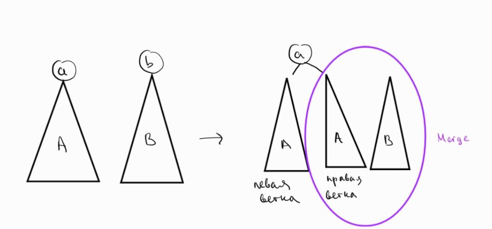
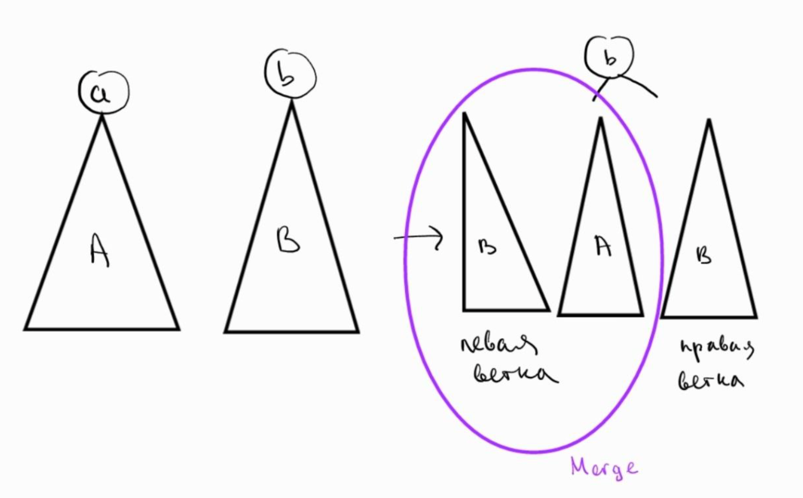
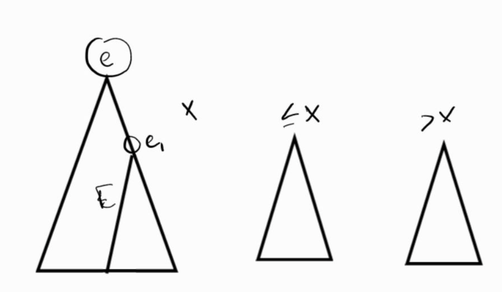

###  Декартово дерево по неявному ключу

---
***Декартово дерево по неявному ключу*** - это структура данных, которая сочетает в себе
свойства бинарного дерева поиска (BST; по позиции/неявному ключу)
и бинарной кучи (heap; по приоритету), используя неявные ключи для задания порядка
элементов в массиве.

Данная структура имеет такие поля:
- значение (x)
- приоритет (y)
- левое поддерево
- правое поддерево
- размер поддерева (sz)
---
Пример реализации:
``` cpp
struct Treap {
public:
    int x;
    int y;
    int sz;

    Treap* left;
    Treap* right;

    static int getSz(Treap* t) { return t ? t->sz : 0; }

    Treap(int x, int y, Treap* left = nullptr, Treap* right = nullptr)
        : x(x), y(y), left(left), right(right)
    {
        sz = 1 + getSz(left) + getSz(right);
    }
};
``` 
---

***Инварианты treap:***
1. BST-инвариант определяется по позиции в массиве,
например, относительно данной вершины: элементы, находящиеся левее в массиве,
будут находиться в левом поддереве. Стоящие правее -
в правом.
2. heap-инвариант определяется по приоритету: больший приоритет находится выше
(можно сделать наоборот - меньший приоритет выше). Нужен, чтобы автоматически
поддерживать балансировку дерева. Приоритет определяется случайным числом,
благодаря чему ожидаемая высота равна O(log(n)), а вероятность большой
высоты мала.

***Уточнение:*** в моем повествовании не будет совпадающих приоритетов

---
*<u>Переход к неявному ключу:</u>*
Основная идея заключается в том, что ключ не хранится
напрямую, а определяется по индексу элемента в массиве.
Поэтому sz является необходимым параметром; без него будет
невозможно выполнить последующие операции за логарифм. sz(left)
показывает, сколько элементов стоит перед текущим узлом внутри поддерева.
---
Теперь поговорим о базовых операциях.

- добавление элемента x на позицию k
- удаление элемента на позиции k
- соединение двух деревьев
- разделение одного дерева на два
- получение k элемента

Все операции основываются на merge и split, поэтому сначала обсудим их.
Сначала обсудим соединение двух деревьев или ***Merge***:

*<u>Важный момент:</u>* Merge(A, B), где А - первое дерево, а В - второе, возможен
только тогда, когда все элементы массива А должны идти раньше любого элемента массива В

Итак, Merge выбирает корень по приоритету:
- Если приоритет вершины a - корень дерева А - больше
приоритета вершины b - корень дерева B, то а будет корнем общего дерева. Порядок элементов
сохранится, как конкатенация.
- Иначе наоборот - b будет корнем общего дерева

Рассмотрим код реализации данной функции:
``` cpp
static Treap* Merge(Treap* L, Treap* R) {
if (L == nullptr) return R;
if (R == nullptr) return L;

    if (L->y > R->y) {
        Treap* newR = Merge(L->right, R);
        return new Treap(L->x, L->y, L->left, newR);
    } else {
        Treap* newL = Merge(L, R->left);
        return new Treap(R->x, R->y, newL, R->right);
    }
}
```

Таким образом в первой ситуации в итоговом дереве левая ветка будет левой веткой
из изначального дерева А, а правая результатом Merge(правой ветки изначального А и B).
Далее рекурсивно будут соединяться деревья, пока одно из деревьев (или оба) не станут пустым


В обратной ситуации все будет работать с точностью наоборот:


Теперь рассмотрим ***Split***.
В декартовом дереве по неявному ключу операция Split(T, k) делит дерево T на два
дерева (A, B) так, что:
A содержит первые k элементов последовательности (inorder-обхода),
B содержит все остальные элементы.
Пусть L = sz(T->left) — количество элементов в левом поддереве текущей вершины.
- Если k <= L, то разрез находится в левом поддереве: рекурсивно делаем Split(T->left, k).
Тогда B будет состоять из текущей вершины и её правого поддерева, а
левым ребёнком вершины в B станет часть, оставшаяся после разреза.
- Иначе (k > L), разрез находится в правом поддереве: рекурсивно делаем Split(T->right, k - L - 1).
Тогда A будет состоять из текущей вершины и её левого поддерева, а
правым ребёнком вершины в A станет часть, полученная после разреза.
После переподвешивания поддеревьев необходимо корректно пересчитать sz.
*<u>Важно</u>*: здесь k — это количество элементов, которые должны
оказаться слева (в A). Это и есть “неявный ключ”.

Рассмотрим код реализации:
``` cpp
static void Split(Treap* t, int k, Treap*& L, Treap*& R) {
    if (t == nullptr) {
        L = nullptr;
        R = nullptr;
        return;
    }
    int leftSize = Treap::getSz(t->left);
    if (k <= leftSize) {
        Treap* newLeft = nullptr;
        Treap* newRight = nullptr;
        Split(t->left, k, newLeft, newRight);
        R = new Treap(t->x, t->y, newRight, t->right);
        L = newLeft;
    } else {
        Treap* newLeft = nullptr;
        Treap* newRight = nullptr;
        Split(t->right, k - leftSize - 1, newLeft, newRight);
        L = new Treap(t->x, t->y, t->left, newLeft);
        R = newRight;
    }
}
```

Схема первой ситуции:

Второй:


Вставка элемента на позицию k (***Insert***)

Идея: разрезаем массив на префикс и суффикс, вставляем новый узел между ними.
(A, B) = Split(T, k) — A: первые k, B: остальные
T = Merge(Merge(A, new(x)), B)

Реализация:
``` cpp
static Treap* Insert(Treap* t, int k, int x, int y) {
    Treap* A = nullptr;
    Treap* B = nullptr;
    Split(t, k, A, B);
    Treap* mid = new Treap(x, y);
    return Merge(Merge(A, mid), B);
}

```

Удаление элемента на позиции k (***Erase***)

Идея: выделяем k-й элемент отдельным деревом и выкидываем.
(A, B) = Split(T, k) — A: первые k, B: начиная с k
(mid, C) = Split(B, 1) — mid: первый элемент B (это k-й элемент), C: остальные
T = Merge(A, C)

Реализация:
``` cpp
static Treap* Erase(Treap* t, int k) {
    Treap* A = nullptr;
    Treap* B = nullptr;
    Split(t, k, A, B);

    Treap* mid = nullptr;
    Treap* C = nullptr;
    Split(B, 1, mid, C);
    return Merge(A, C);
}

```

Получение k элемента (**Get**)

Идея: спускаемся по дереву, используя sz(left).

Реализация:
``` cpp
static int GetKth(Treap* t, int k) {
    int leftSize = Treap::getSz(t->left);
    if (k < leftSize) return GetKth(t->left, k);
    if (k == leftSize) return t->x;
    return GetKth(t->right, k - leftSize - 1);
}

```

---
***Асимптотика***
1. Merge и Split работают за O(h), где h — высота дерева,
потому что рекурсия идёт вдоль одного пути вниз (каждый шаг уходит либо влево, либо вправо).
- При случайных независимых приоритетах форма treap распределена как случайное
BST (эквивалентно: ключи вставлялись в случайном порядке).
- Из этого следует, что ожидаемая глубина вершины E[depth]=O(log(n)), а значит и E[h]=O(log(n)).
- Следовательно:
E[time(Merge)]=O(log(n)), 
E[time(Split)] = O(log(n))
2. insert/erase/kth/range строятся из константного числа split/merge → тоже O(log n) в ожидании.

---
***Эвристики***
1. Приоритеты лучше 64-битный RNG, чтобы не было при совпадений приоритетов.
2. Поддержка sz обязателено sz=1+sz(left)+sz(right); пересчитываем после каждого изменения детей
3. Риск вырождения теоретически возможен худший случай O(n),
но при случайных приоритетах ожидаемо O(log n), и “плохие” случаи редки.